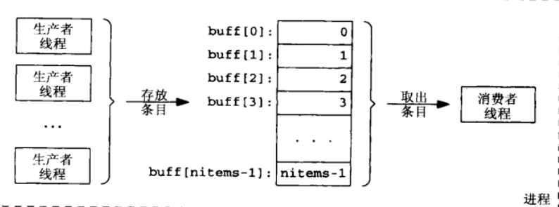

# 互斥与条件变量


> 前言：现在我们开始学习如何同步多个线程，从最简单的「互斥」开始，废话不多说，让我们开始吧


## 0X00 互斥的感性认识


互斥是最简单的同步形式，简单来说，就是一个锁问题，


上锁的时候，**只有一个线程能够执行"锁里面"的代码**


什么是锁里面的代码呢？代码一般长这个样子：


```c
lock_the_mutex(...);

// 锁里面的代码，我们把它叫做临界区
...
unlock_the_mutex();
```


那这个锁锁住的是什么呢？**锁住的是线程之间共享的资源**，也就是说，当前线程上锁的时候，只有当前线程能够修改共享的资源，其他的线程都不行


接下来我们介绍与互斥相关的 c 函数


```c
#include <pthread.h>

int pthread_mutex_lock(pthread_mutex_t *mptr);
int pthread_mutex_unlock (pthread_mutex_t *mpir);
```


## 0X01 逃不开的经典问题——生产者与消费者问题


接下来我们用学到的知识实现下述的模型：





****


**有数个生产者线程给一块区域填值，等到所有生产者结束操作，消费者才能去动那块区域**


书上的源程序在这里：


https://github.com/TensShinet/learn_IPC/blob/master/book_code/mutex/prodcons2.c


这是我的程序，但是这个程序有点问题（只执行了一个线程，其他线程不执行）


```c
#include "./unpipc.h"


#define MAXNITEMS 1000000
#define MAXNTHREADS 100

int nitems;

struct {
    // 互斥锁
    pthread_mutex_t mutex;

    // 共享资源
    int buff[MAXNITEMS];
    // buff 的索引
    int nput;
    // 放进去的值
    int nvalue;
} shared = { PTHREAD_MUTEX_INITIALIZER };

/*
argv 输入 线程数 和 要产生多少 item 的数目

share.nput 记录着要写入的 buff 索引

share.nvalue 记录要写入的值
*/

void *produce(void *);
void *consume(void *);

int main(int argc, char **argv) {

    int i, nthreads, count[MAXNTHREADS];
    pthread_t tid_produce[MAXNTHREADS], tid_consume;

    if(argc != 3) {
        perror("usage:  prodcons2 <#items> <#threads>");
    }

    nitems = min(atoi(argv[1]), MAXNITEMS);
    nthreads = min(atoi(argv[2]), MAXNTHREADS);

    // 设置并发
    thr_setconcurrency(nthreads);
    // 产生所有的生产者
    for(i = 0; i < nthreads; i++) {
        count[i] = 0;
        pthread_create(&tid_produce[i], NULL, produce, &count);
    }

    // 等待所有生产者
    for(i = 0; i < nthreads; i++) {
        pthread_join(tid_produce[i], NULL);
        // 看每个线程执行了多少次
        printf("[%d]th thread = %d\n", i, count[i]);
    }

    // 创建消费者
    pthread_create(&tid_consume, NULL, consume, NULL);
    // 等待消费者
    pthread_join(tid_consume, NULL);
    return 0;
}

void *produce(void *arg) {
    for (;;) {   
        // 上锁
        pthread_mutex_lock(&shared.mutex);
        // 数组满了，解锁退出线程
        if (shared.nput >= nitems) {
            pthread_mutex_unlock(&shared.mutex);
            return (NULL);
        }
        shared.buff[shared.nput] = shared.nvalue;
        shared.nput++;
        shared.nvalue++;
        *((int *)arg) += 1;
        pthread_mutex_unlock(&shared.mutex);
    }
}
/*

如果按照我们想象的那样 

buff[i] == i

所以我们的消费者只是用来检测是否出错
*/
void *consume(void *arg) {
    int i;
    printf("nitems %d\n", nitems);
    for (i = 0; i < nitems; i++)
    {
        if (shared.buff[i] != i) {
            printf("buff[%d] = %d\n", i, shared.buff[i]);
        }
    }
    return (NULL);
}
```


头文件在这里：https://github.com/TensShinet/learn_IPC/blob/master/my_code/mutex/unpipc.h


## 0X02 条件变量的感性认识


我们从最简单的互斥开始，开始线程之间的同步，紧接着为了优化这个程序的速度，我们为什么不可以做到，生产者一产生，消费者就拿走


而不是像之前那样，所有生产者都产生完了，消费者再行动


为了达到这个目的，我们必须在每次消费者消费之前，检查生产者是否完成了对该区域的生产，为了达到这个目的，我们必须不停的解锁，上锁，完成对该区域的检查，这个叫做`轮询`


有了`条件变量`以后，不需要这样做，除了上锁，我们还可以`等待`


一旦某个条件没达成，这个线程就`阻塞等待`，一旦这个这个条件达成了，这个线程就被唤醒，这就是「条件变量」


**接下来我们介绍与条件变量相关的函数**


```c
 #include <pthread.h>
 int pthread_cond_wait(pthread_cond_t *cond,
                      pthread_mutex_t *mutex);   
 int pthread_cond_signal(pthread_cond_t *cond);  
```


**前者用来当条件不满足时阻塞，后者被用来设置满足条件。而且条件变量一定会和一个互斥锁绑定在一起**


## 0X03 使用「条件变量」解决生产者与消费者问题


接下来我们用「条件变量」解决生产者与消费者问题


现在我们的问题是：


`如何在生产者产生条目以后，消费者能够立即使用`


```c
#include "./unpipc.h"

#define MAXNITEMS 1000000
#define MAXNTHREADS 100

int nitems = 0;

struct
{
    // 互斥锁
    pthread_mutex_t mutex;

    // 共享资源
    int buff[MAXNITEMS];
    // buff 的索引
    int nput;
    // 放进去的值
    int nvalue;
} put = {PTHREAD_MUTEX_INITIALIZER};

struct {
    pthread_mutex_t mutex;
    pthread_cond_t cond;
    int nready; /* number ready for consumer */
} nready = {PTHREAD_MUTEX_INITIALIZER, PTHREAD_COND_INITIALIZER};

/*
argv 输入 线程数 和 要产生多少 item 的数目

share.nput 记录着要写入的 buff 索引

share.nvalue 记录要写入的值

条件变量的结构体设置三个值

mutex 用于锁
cond 用于条件满足的 signal
nready 如果生产者产生了一个 item nready++ 然后设置条件
消费者线程被唤醒，执行操作以后，nready--
*/

void *produce(void *);
void *consume(void *);

int main(int argc, char **argv)
{
    int i, nthreads, count[MAXNTHREADS];
    pthread_t tid_produce[MAXNTHREADS], tid_consume;

    if (argc != 3)
    {
        printf("usage:  prodcons2 <#items> <#threads>");
        return 0;
    }

    nitems = min(atoi(argv[1]), MAXNITEMS);
    nthreads = min(atoi(argv[2]), MAXNTHREADS);

    // 设置并发
    // pthread_setconcurrency(nthreads + 1);
    // 产生所有的生产者
    for (i = 0; i < nthreads; i++)
    {
        count[i] = 0;
        pthread_create(&tid_produce[i], NULL, produce, &count);
    }
    // 创建消费者
    pthread_create(&tid_consume, NULL, consume, NULL);

    for (i = 0; i < nthreads; i++)
    {   
        pthread_join(tid_produce[i], NULL);
        // 看每个线程执行了多少次
        printf("[%d]th thread = %d\n", i, count[i]);
    }
    // 等待消费者
    pthread_join(tid_consume, NULL);
    return 0;
}

void *produce(void *arg)
{

    for (;;)
    {
        // 上锁
        pthread_mutex_lock(&put.mutex);
        // 数组满了，解锁退出线程
        if (put.nput >= nitems)
        {
            pthread_mutex_unlock(&put.mutex);
            return (NULL);
        }
        put.buff[put.nput] = put.nvalue;
        put.nput++;
        put.nvalue++;
        *((int *)arg) += 1;
        pthread_mutex_unlock(&put.mutex);

        // 完成一次操作
        pthread_mutex_lock(&nready.mutex);
        if (nready.nready == 0)
            // 唤醒另外一个线程
            pthread_cond_signal(&nready.cond);
        nready.nready++;
        pthread_mutex_unlock(&nready.mutex);
    }
}
/*

如果按照我们想象的那样 

buff[i] == i

所以我们的消费者只是用来检测是否出错
*/
void *consume(void *arg)
{
    int i;
    for (i = 0; i < nitems; i++)
    {
        pthread_mutex_lock(&nready.mutex);
        while (nready.nready == 0)
            pthread_cond_wait(&nready.cond, &nready.mutex);
        nready.nready--;
        pthread_mutex_unlock(&nready.mutex);

        if (put.buff[i] != i)
        {
            printf("buff[%d] = %d\n", i, put.buff[i]);
        }
    }
    return (NULL);
}
```

头文件在这里：https://github.com/TensShinet/learn_IPC/blob/master/my_code/mutex/unpipc.h


虽然这个代码看起来复杂其实是有套路的，我们要做的就是记住这个套路，给条件变量发送信号的代码大体如下：


```c
struct {
    pthread_mutex_t mutex;
    pthread_cond_t cond;
    // 维护本条件的各个变量
} var = {PTHREAD_MUTEX_INITIALIZER, PTHREAD_COND_INITIALIZER};

pthread_mutex_lock(&var.mutex);

// 条件为真
// 发信号
pthread_cond_signal(&var.cond);
pthread_mutex_unlock(&var.mutex);


pthread_mutex_lock(&var.mutex);
while(条件为假)
    // 阻塞
    pthread_mutex_wait(&var.cond, &var.mutex);

// 修改条件
...
    
 pthread_mutex_unlock(&var.mutex);
```


**默认情况下，pthread_mutex_lock 是阻塞函数，如果两个线程使用同一个互斥锁，那么后使用的会被阻塞，直到这个锁被解开，上述的代码就有这个问题，重复上锁，导致阻塞，修改方式如下**


```c
int t = 0;
// 完成一次操作
pthread_mutex_lock(&nready.mutex);
t = nready.nready == 0 ? 1 : 0
nready.nready++;
pthread_mutex_unlock(&nready.mutex);

if(t) {
    // 唤醒另外一个线程
    pthread_cond_signal(&nready.cond);
}
```


## 0X04「条件变量」高级用法


这部分的内容在《UNIX 网络编程——进程间通信》7.6 以后，本博客只稍微介绍一点


```c
#include <pthread.h>

// 唤起所有被相同条件阻塞的线程
int pthread_cond_broadcast (pthread_cond_t *cpir);

// 阻塞有时间限制
int pthread_cond_timedwait (pthread_cond_t *cpir, pthread_mutex_t *mptr,
const struct timespec abstime);
```


