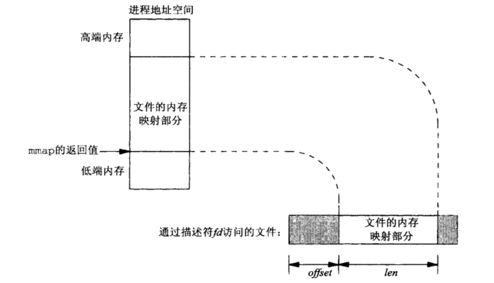
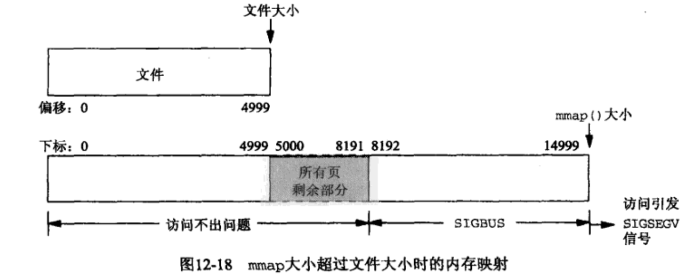

# 共享内存基础


> 前言：共享内存的基础知识总结


`听说没有图，你们就不会点进来？`


## 0X00 共享内存区的感性理解


共享内存区是可用 IPC 最快的，`一旦有这样的内存区映射到不同进程间，那么这些进程通过「共享内存区」的数据传递就不再涉及内核`


**然而往该共享内存区写读数据，要用到我们之前学到的同步的技术：比如互斥锁，条件变量，读写锁，记录锁，信号量**


往往用一张图就能说明这种关系：


图上有两个进程：`客户进程`和`服务器进程`，演示的是这两个进程之间传递一个文件的内容


**由于共享内存的存在，客户进程和服务器进程之间的文件内容的传递，可以直接由服务器进程读入文件到共享内存区，然后由客户进程直接从共享内存区里面读**


再也不需要这样：


`不需要像这样通过内核传递数据了`


## 0X01 与共享内存区相关的底层函数


首先介绍的是 mmap 和 munmap，我们用 man 看一下：


```c
void *mmap(void *addr, size_t len, int prot, int flags,
           int fd, off_t offset);
int munmap(void *addr, size_t len);
```


mmap 函数把**一个文件**或一个 **Posix 共享内存区对象**，映射到调用进程的地址空间，书上说使用此函数有三个目的：


1) `将普通文件映射到进程空间中，实现文件的读写`

2) `使用特殊文件以提供匿名内存映射`

3) `使用 shm_opt（下一篇博客的内容）以提供进程间的 Posix 共享内存`


**我们来看第一个使用方法：**




+ 第一个参数的意思，你想设定的映射以后的起始地址，我们通常设置为 NULL，也就是内核决定
+ len 和 offset 如图中所示
+ prot 代表着被映射内存部分的**保护权限**：可读、可写、可执行
+ flags 决定着一个进程对一个共享内存区的操作能不能被其他也共享这片区域的进程看到


更多内容参考：http://man7.org/linux/man-pages/man2/mmap.2.html


munmap 显而易见的作用是：删除映射的区域


最后我们再来介绍`msync`，同样我们 man 看一下：


```c
int msync(void *addr, size_t length, int flags);
```


man 里面说：msync 将对共享内存区的修改冲刷进用 mmap 共享的文件里。如果不使用这个函数，就不能确定在 munmap 之前完成了更新


`msync 通过 flags 设置是阻塞冲刷还是异步冲刷`


更多内容参考：http://man7.org/linux/man-pages/man2/msync.2.html


## 0X02 程序举例


+ 父子进程通过 mmap 给同一个文件写入一个计数器


```c
#include "unpipc.h"

#define SEM_NAME "/mysem"

int main(int argc, char **argv)
{
    int fd, i, nloop, zero = 0;
    int *ptr;
    sem_t *mutex;

    if (argc != 3)
        printf("usage: incr2 <pathname> <#loops>");
    nloop = atoi(argv[2]);

    /* 4open file, initialize to 0, map into memory */
    fd = open(argv[1], O_RDWR | O_CREAT, FILE_MODE);
    // 将初值设为 0
    write(fd, &zero, sizeof(int));
    int* addr = mmap(NULL, sizeof(int), PROT_READ | PROT_WRITE, MAP_SHARED, fd, 0);
    ptr = addr;
    close(fd);

    /* 4create, initialize, and unlink semaphore */
    mutex = sem_open(SEM_NAME, O_CREAT | O_EXCL, FILE_MODE, 1);
    if (mutex == SEM_FAILED) {
        printf("%d\n", errno);
    }
    sem_unlink(SEM_NAME);


    setbuf(stdout, NULL);

    if (fork() == 0) {
        for (i = 0; i < nloop; i++)
        {
            sem_wait(mutex);
            printf("child: %d\n", (*ptr)++);
            sem_post(mutex);
        }
        exit(0);
    }


    for (i = 0; i < nloop; i++) {
        sem_wait(mutex);
        printf("parent: %d\n", (*ptr)++);
        sem_post(mutex);
    }
    exit(0);
}
```


+ **BSD 匿名内存映射**


```c
ptr = mmap(NULL, sizeof(int), PROT_READ | PROT_WRITE,
			   MAP_SHARED | MAP_ANON, -1, 0);
```


就是提供一个无名内存空间，用于有亲缘关系的进程通信


+ **/dev/zero 内存映射**


```c
fd = open("/dev/zero", O_RDWR);
ptr = mmap(NULL, sizeof(int), PROT_READ | PROT_WRITE, MAP_SHARED, fd, 0);
```


由于我们只管进程间的数据传递，其本身使用的文件并不重要，而在我们使用的操作系统中，有这样一个文件很奇特，它可以提供无数个 0，对它写也不改变它文件的值，它就是 /dev/zero，所以拿它当 mmap 的文件就很方便，不用管这个文件


还有一个神奇的文件是 /dev/null


## 0X03 对 mmap 的底层探讨


书上对这一部分解释的很详细，我在这里做一个总结


1. **mmap 以后的虚存空间大小一定是页大小的倍数，因为内存就是按页来管理的**


2. **当文件大小和申请的大小一致，但不是页大小的倍数时，内核允许我们对超出的部分进行读写，但是超出的内容不会写进文件里面**





3. **当文件大小小于申请的大小一致，且 mmap 的结束地址与文件大小的结束地址不在一个页内的时候，内核只允许我们在文件结束地址所在的页中对超出的部分进行读写，但是超出的这个页的内容不允许读写，会 SIGBUS 的错误**


