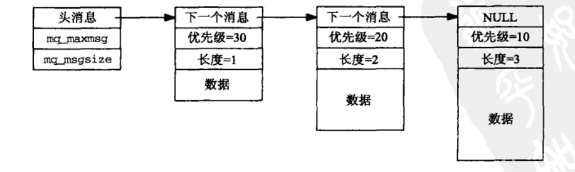

# 消息队列总结


> 前言：进程间通信的另一大重点，但是难度也不大，废话不多说，让我们开始


## 0X00 消息队列介绍


在`内核中一个消息队列`表示的方式如下：




+ 首先`消息队列`是一个链表的方式存在，和管道不同
+ 头部消息记录着这个消息队列`最大长度（mq_maxsmsg）`，以及`最大消息长度（mq_msgsize）`

  


其中优先级小的就在前面，优先级大的在后面


## 0X01 与消息队列相关的函数


`消息队列`涉及的 api 有很多，尽量用多的例子来演示这些 api


### 创建 打开 关闭 删除


+ `mg_open 函数创建一个新的消息队列`或者`打开一个已存在的消息队列`


```c
#include <mqueue.h> 

mqd_t mq_open(const char *name, int oflag, ...
              /*mode_t mode, struct mq_attr* attr/) 
```


当实际操作是一个新队列时，`mode 和 attr `  是必须的，如果是打开一个消息队列则不需要


我们来说说每个参数的含义：


1) `name`  


指队列的名称  


2) `oflag`


是队列的 flag，比如 O_RDONLY 就是只接受消息；O_WRONLY 只发送消息；O_RDWR 表示又可以读又可以写；O_NONBLOCK 就是在非阻塞的情况下使用该队列。


在没有设置非阻塞的情况下，如果队列满了，mq_send() 就会阻塞，而如果队列是空的，mq_receive 也会阻塞


3) `mode`


mode 定义了队列的权限


4) `attr`


attr 指向了一个 mq_attr 的结构体，定义如下：


```c
struct mq_attr {
    long mq_flags;       /* Flags: 0 or O_NONBLOCK */
    long mq_maxmsg;      /* Max. # of messages on queue */
    long mq_msgsize;     /* Max. message size (bytes) */ 
    long mq_curmsgs;     /* # of messages currently in queue */
};         
```


其中 mq_maxmsg 的值应该`小于等于 /proc/sys/fs/mqueue/msg_max` 里面的值（默认是 10），mq_msgsize 的值应该`小于等于/proc/sys/fs/mqueue/msgsize_max` 里面的值（默认 8192）这些限制可能被特殊进程忽略


如果 mq_open 调用成功，则返回`消息队列描述符`。`消息队列描述符`可以在队列的后续调用中使用。


+ `mq_close 函数关闭消息队列描述符`


```c
#include <mqueue.h>

int mq_close (mqd_t mqdes);
```


其功能与关闭一个已经打开文件的 close 函数类似，但是并不会从系统中删除，


一个进程终止时，它所有打开着的消息队列都会关闭


+ `mq_unlink 从系统中删除一个消息队列`


每个消息队列都有一个保存当前打开着描述符数目的引用计数器，当计数大于 0 时，你只能删掉它的名字，但是它真正的析构要等到最后一个 mq_close


现在我们使用一个小程序验证上述的知识点：


```c
#include "./unpipc.h"

int main(int argc, char **argv)
{
    int c, flags;
    mqd_t mqd;

    if (argc != 2)
        perror("usage: mqcreate  <name>");

    flags = O_RDWR | O_CREAT;
    mqd = mq_open(argv[1], flags, FILE_MODE, NULL);

    if(mqd == -1) {
        perror("mq_open fails");
    }
    // 关闭消息队列
    mq_close(mqd);
    // 删除消息队列
    int a = mq_unlink(argv[1]);
    if(a) {
        perror("mq_unlink fails");
    }
    return 0;
}

```

头文件地址：https://github.com/TensShinet/learn_IPC/blob/master/my_code/msg_queen/unpipc.h


在没有删除的情况下，可以去 `/dev/mqueue` 下查看，创建的消息队列


### 得到与设置消息队列相关属性


```c
#include <mqueue.h>

int mq_getattr(mqd_t mqdes, struct mq_attr *attr);

int mq_setattr(mqd_t mqdes, const struct mq_attr *newattr,
                    struct mq_attr *oldattr);
```


`皆返回，若成功则为 0，若出错则返回 -1`


我们在创建消息队列的时候，可以设置消息队列的属性，还可通过上述两个函数得到与修改消息队列的属性


看一个例子：输入一个消息队列的名字，输出它的属性


```c
#include "./unpipc.h"

int main(int argc, char **argv)
{
    mqd_t mqd;
    struct mq_attr attr;

    if (argc != 2)
        perror("usage: mqgetattr <name>");

    mqd = mq_open(argv[1], O_RDONLY);

    mq_getattr(mqd, &attr);
    printf("max #msgs = %ld, max #bytes/msg = %ld, "
           "#currently on queue = %ld\n",
           attr.mq_maxmsg, attr.mq_msgsize, attr.mq_curmsgs);

    mq_close(mqd);
    exit(0);
}

```

头文件地址：https://github.com/TensShinet/learn_IPC/blob/master/my_code/msg_queen/unpipc.h


### 发送 接收


```c
#include <mqueue.h>

int mq_send (mqd_t mqdes, const char *msg_ptr, size_t msg_len, 
             unsigned int msg_prio);
             
ssize_t mq_receive (mqd_t mqdes, char *msg_ptr, size_t msg_len, 
                    unsigned int *msg_prio);
```


这两个函数分别用于往一个队列中放置一个消息和从一个队列中取走一个消息，**每一个消息都有一个优先级**


它是一个小于 `MQ_PRIO_MAX` 的无符号整数 `MQ_PRIO_MAX` 至少为 32


+ mq_send 成功返回 0，出错返回 -1
+ mq_receive 成功返回消息中的字节数，出错返回 -1 


还要注意一点的是：


mq_receive 的 len 参数不能小于`队列中消息的最大大小（也就是 mq_msgsize 成员）`


**接下来我们使用已知消息队列发送与接收消息**：


+ send


```c
#include "./unpipc.h"

int main(int argc, char **argv)
{
    mqd_t mqd;
    void *ptr;
    size_t len;
    unsigned int prio;

    if (argc != 4)
        perror("usage: mqsend <name> <#bytes> <priority>");
    len = atoi(argv[2]);
    prio = atoi(argv[3]);

    mqd = mq_open(argv[1], O_WRONLY);
    if (mqd == -1) {
        perror("mq_open");
    }
    
    ptr = calloc(len, sizeof(char));
    scanf("%s", (char *)ptr);

    int a = mq_send(mqd, ptr, len, prio);
    if(a == -1) {
        perror("mq_send");
    }
    mq_close(mqd);
    exit(0);
}
```


```shell
➜  msg_queen git:(master) ✗ gcc mqsend.c -o mqsend.out -lrt
➜  msg_queen git:(master) ✗./mqsend.out /mq2 10 10
LoveYou
```


+ receive


```c
#include "unpipc.h"

int main(int argc, char **argv)
{
    mqd_t mqd;
    ssize_t n;
    unsigned int  prio;
    void *buff;
    struct mq_attr attr;

    mqd = mq_open(argv[1], O_RDONLY);
    if(mqd == -1) {
        perror("mq_open");
    }
    mq_getattr(mqd, &attr);

    buff = malloc(attr.mq_msgsize);

    n = mq_receive(mqd, buff, attr.mq_msgsize, &prio);
    printf("read %ld bytes, priority = %u mq_msgsize = %ld\n", (long)n, prio, attr.mq_msgsize);
    printf("read cotent: %s", (char *)buff);

    mq_close(mqd);

    return 0;
}
```


```shell
➜  msg_queen git:(master) ✗ ./mqreceive.out /mq2
read 10 bytes, priority = 10 mq_msgsize = 8192
read cotent: LoveYou%   
```


头文件地址：https://github.com/TensShinet/learn_IPC/blob/master/my_code/msg_queen/unpipc.h


对于消息队列的阻塞部分就是这么多的内容，对于消息队列的非阻塞部分，等学完后面的知识以后，我们继续完善


