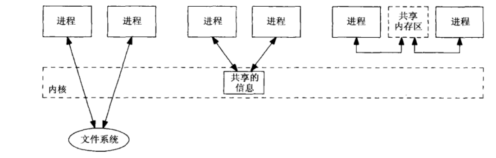
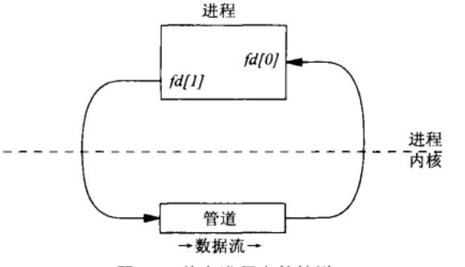
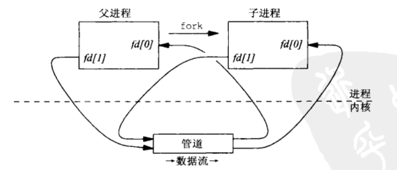
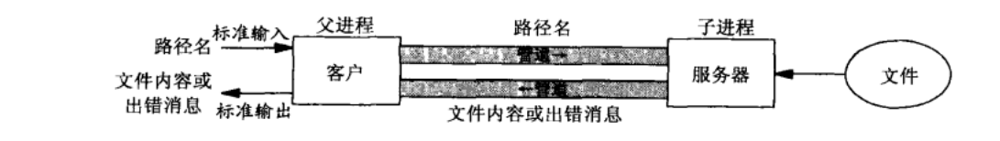
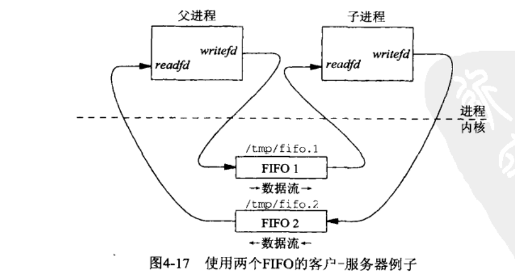
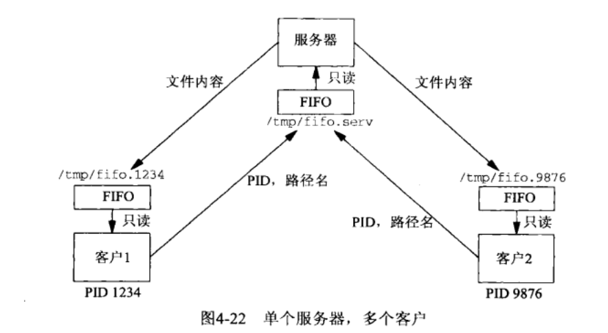

# 管道和 FIFO 总结


> 开始系统学习进程间通信





对于进程间的通信大概可以抽象成以上三种，而我们第一次介绍的管道和 FIFO 就是第二种


## 0X00 管道通信——Pipe





如上图所示，使用 pipe 的原理就是在内核中创建一个`管道，一头用来读，一头用来写`。虽然管道是单进程创建的，但是管道的典型用途是`兄弟，父子`进程的通信手段之一：





在 c 语言中，使用：


```c
    int p[2];
    pipe(p);
```


p[0], p[1] 会存放着两个文件描述符。其中`p[0] 用来读，p[1] 用来写`


接下来我们用 c 实现下面的程序，书上的原 c 程序在这里：https://github.com/TensShinet/learn_IPC/blob/master/book_code/pipe/mainpipe.c





```c

#include "./pipe.h"

void server(int readfd, int writefd) {
	// 子进程
	// 使用 popen + cat 读取文件
	size_t len;
	ssize_t n;
	char buff[MAXLINE+1];
	char command[MAXLINE];

	// 读取文件名
	if ((n = read(readfd, buff, MAXLINE)) == 0) {}
	buff[n] = '\0';
	sprintf(command, "cat %s", buff);

	// 使用 popen 读取文件
	FILE *catfp = popen(command, "r");
	while (fgets(buff, MAXLINE + 1, catfp) != NULL) {
		write(writefd, buff, strlen(buff));
	}

	pclose(catfp);
}

void client(int readfd, int writefd) {
	// 父进程
	// 输入路径
	// 将得到的文件内容写入输出流
	size_t len;
	ssize_t n;
	char buff[MAXLINE];

	fputs("file path:", stdout);
	fgets(buff, MAXLINE, stdin);
	len = strlen(buff);

	if(buff[len-1] == '\n') {
		len--;
	}

	// 写入文件路径
	write(writefd, buff, len);

	// 写入输出
	while ((n = read(readfd, buff, MAXLINE)) > 0) {
		write(1, buff, n);
	}
}

int main() {

	int pipe1[2], pipe2[2];

	// 创建两个 pipe
	pipe(pipe1);
	pipe(pipe2);

	pid_t child_pid;
	if((child_pid = fork()) == 0) {
		// 子进程
		close(pipe1[1]);
		close(pipe2[0]);
		server(pipe1[0], pipe2[1]);
	} else
	
	{
		// 父进程
		close(pipe2[1]);
		close(pipe1[0]);
		client(pipe2[0], pipe1[1]);
		waitpid(child_pid, NULL, 0);
	}
	

	return 0;
}
```


有关头文件的代码在这里：


https://github.com/TensShinet/learn_IPC/blob/master/my_code/pipe/pipe.h


## 0X01 FIFO


FIFO 也是管道，它的特殊之处在于，他有一个名字，和文件系统的一个文件挂钩，`可以让无亲缘关系的进程之间通信`





而且一个 FIFO 是半双工的，打开一个 FIFO 要么读要么写，不能又读又写。


关于 FIFO 有以下几个函数：


+ 创建 FIFO


```c
#include <sys/types.h>
#include <sys/stat.h>
int mkfifo(const char *pathname, mode_t mode);
```


mode 用来指明这个 mode 的 状态，我们可以用下面的方法定义一个供`用户读，用户写，组成员读，其他成员读`的 mode


```c
#define FILE_MODE (S_IRUSR | S_IWUSR | S_IRGRP | S_IROTH)
/* default permissions for new files */
```


+ 打开 FIFO


使用 open 打开 FIFO


```c
#define	FIFO1	"/tmp/fifo.1"
#define	FIFO2	"/tmp/fifo.2"

// 只写
int writefd = open(FIFO1, O_WRONLY, 0);
// 只读
int readfd = open(FIFO2, O_RDONLY, 0);
```


不管原 FIFO 存不存在，我们一般使用，mkfifo(如果存在也没关系)再 open


+ 删除 FIFO


进程结束以后，管道会关闭，但是与 FIFO 挂钩的名字，必须使用 unlink 才能使之从`文件系统中消失`


```c
#define	FIFO1	"/tmp/fifo.1"

unlink(FIFO1);
```


接下来我们写一个服务器与客户端分离的程序，书上的源程序在这里：https://github.com/TensShinet/learn_IPC/tree/master/book_code/fifocliserv





这个程序与我们之前的功能差不多，只是这个客户端与服务器可以不再有亲缘关系


```c
#include "./unpipc.h"
#include "./fifo.h"

// 客户端
/*
打开 FIFO server 的读写端

得到自己的 pid

输入路径

创建自己的 FIFO

将 pid 与路径结合,写入 server FIFO 写端

删除自己的 FIFO
*/
int main() {
    int readfifo, writefifo, dummyfd, fd;
    char *ptr, buff[MAXLINE], fifoname[MAXLINE], path[MAXLINE];
    pid_t pid;
    ssize_t n;


    // 得到自己的 pid
    pid = getpid();
    sprintf(fifoname, "/tmp/fifo.%ld", (long)pid);


    // 创建自己的 FIFO
    if ((mkfifo(fifoname, FILE_MODE) < 0) && (errno != EEXIST))
        fprintf(stderr, "can't create %s", fifoname);


    fputs("file path:", stdout);
    // 输入路径
    fgets(path, MAXLINE, stdin);


    // 打开服务器的写端
    writefifo = open(SERV_FIFO, O_WRONLY, 0);

    // 写入 pid 和路径
    sprintf(buff, "%ld %s", (long)pid, path);

    // 写入写端
    write(writefifo, buff, strlen(buff));

    // 打开读端
    readfifo = open(fifoname, O_RDONLY, 0);

    // 读数据
    // int goalfd = open("./test.log", O_WRONLY, 0);
    while((n = read(readfifo, buff, MAXLINE)) > 0) {
        
        write(1, buff, n);
    }

    // close(goalfd);
    close(readfifo);
    // 删除自己的 FIFO
    unlink(fifoname);

    return 0;
}
```


```c
#include "./unpipc.h"
#include "./fifo.h"
// 服务端

/*
打开管道的读写端

从 /tmp/fifo.serv 中读取 filename 以及 pid

读取文件内容

打开客户端的管道的读写端

向客户端的管道写文件内容
*/


int main() {
    int readfifo, writefifo, dummyfd, fd;
    char *ptr, buff[MAXLINE], fifoname[MAXLINE];
    pid_t pid;
    ssize_t n;

    // 打开 server fifo 的套路
    if ((mkfifo(SERV_FIFO, FILE_MODE) < 0) && (errno != EEXIST))
        fprintf(stderr, "can't create %s", SERV_FIFO);

    // 打开 SERV_FIFO 的读写端
    readfifo = open(SERV_FIFO, O_RDONLY, 0);
    writefifo = open(SERV_FIFO, O_WRONLY, 0);

    // 从 readfifo 中读到的文本是
    // 1234 /home/tenshine/nohup.out
    while ( (n = read(readfifo, buff, MAXLINE)) > 0) {
        // 先拿到 pid
        if (buff[n - 1] == '\n')
            n--;        /* delete newline from readline() */
        buff[n] = '\0'; /* null terminate pathname */
        
        // 找到空格
        if ((ptr = strchr(buff, ' ')) == NULL)
        {
            fprintf(stderr, "bogus request: %s", buff);
            continue;
        }

        *ptr++ = 0; /* null terminate PID, ptr = pathname */
        pid = atol(buff);
        sprintf(fifoname, "/tmp/fifo.%ld", (long)pid);

        // 打开另一个进程的 FIFO
        if ((writefifo = open(fifoname, O_WRONLY, 0)) < 0) {
            fprintf(stderr, "cannot open: %s", fifoname);
            continue;
        }


        // 打开文件内容
        if ((fd = open(ptr, O_RDONLY)) < 0)
        {
            snprintf(buff + n, sizeof(buff) - n, ": can't open, %s\n",
                     strerror(errno));
            n = strlen(ptr);
            write(writefifo, ptr, n);
            close(writefifo);
        }
        else
        {
            // 文件内容传输
            while ((n = read(fd, buff, MAXLINE)) > 0) {
                write(writefifo, buff, n);
            }
            close(fd);
            close(writefifo);
        }
    }
    return 0;
}
```


更完整的代码可以看这里：


 


